# 👋 Hi there, I'm Xujiangjing!

🎓 Final-year Computer Science student at King’s College London  

🔬 Research interests:
Formal methods · Automated reasoning · Systems · AI  

⚙️ Current work:
- Fuzzing theorem provers (Isabelle, Zipperposition, Vampire)
- Exploring bugs in ATP pipelines and proof translation
- Operating systems (virtual memory, ELF loading, page faults)
- Machine learning and AI applications  

🧠 Interested in building reliable, verifiable, and intelligent systems
---

## ⏱️ My Coding Activity (WakaTime)

---

## 📊 GitHub Stats

---

## 💻 Languages I Use Most

---

✨ Profile powered by WakaTime & GitHub Readme Stats
